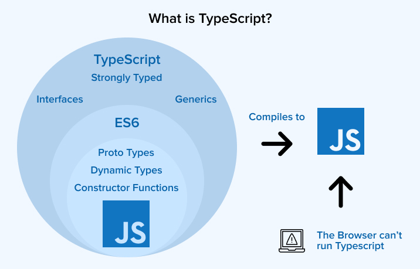
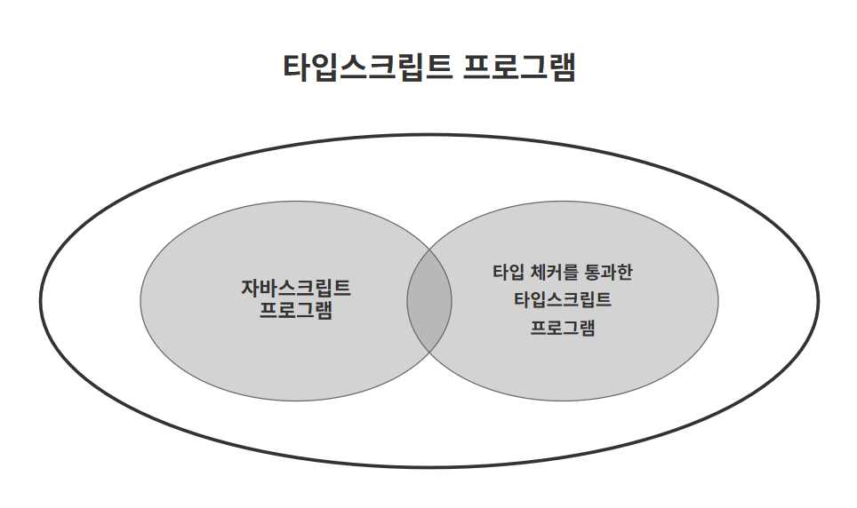

# 아이템 1: 타입스크립트와 자바스크립트의 관계 이해하기

## 타입스크립트는 자바스크립트의 상위 집합(Superset)

타입스크립트는 자바스크립트의 **상위집합**이다. 단순히 개념적인 설명이 아니라 실제로 문법적으로도 상위 집합이다.

### 집합 관계로 이해하기

> 자바스크립트 ⊆ 타입스크립트

이 관계에서 다음 명제들이 성립한다.

-   모든 자바스크립트 코드는 타입스크립트 코드다 ⭕
-   모든 타입스크립트 코드가 자바스크립트 코드는 아니다 ❌



## 타입스크립트의 타입 체커



타입스크립트의 가장 큰 장점을 **컴파일 시점**에 오류를 발견할 수 있다는 것이다.

> 타입스크립트 컴파일러를 사용해서 일반 자바스크립트 프로그램의 타입도 체크할 수 있다!

### 타입 체커가 잡아내는 오류들

#### 1. 오타 및 존재하지 않는 속성

```jsx
let city = 'new york city';
console.log(city.toUppercase());
// ❌ Property 'toUppercase' does not exist on type 'string'.
//     Did you mean 'toUpperCase'?
```

1. 타입스크립트가 `city` 변수의 타입을 `string`으로 추론
2. `string` 타입에는 `toUppercase` 메서드가 없음을 확인
3. 비슷한 이름의 `toUpperCase` 메서드로 수정할 것을 제안

#### 2. 의도와 다른 코드 (논리적 오류)

타입스크립트의 타입 시스템을 사용하면, 오류가 발생하지는 않지만 의도와 다르게 동작하는 코드도 찾아낼 수 있다.

```jsx
const countries = [
    { name: '한국', capital: '서울' },
    { name: '일본', capital: '도쿄' },
    { name: '대만', capital: '타이베이' },
];

for (const country of countries) {
    console.log(`${country.name}의 수도는 ${country.capitol}`);
    // ❌ Property 'capitol' does not exist on type '{ name: string; capital: string; }'.
    //     Did you mean 'capital'?
}
```

-   `JavaScript`의 경우, `undefined`를 출력하지만 오류는 없다
-   `TypeScript`의 경우 컴파일 시점에 오류 발견하고 올바른 속성명을 제안한다

#### 3. 타입 불일치 오류

```tsx
// 런타임에서는 "동작"하지만 의도와 다른 결과를 만드는 코드들
const a = null + 7; // JavaScript: 7, TypeScript: ❌ 오류
const b = [] + 12; // JavaScript: "12", TypeScript: ❌ 오류
alert('Hello', 'TypeScript'); // 두 번째 인수는 무시됨, TypeScript: ❌ 오류
```

이런 코드들은 JavaScript에서는 실행되지만, 타입스크립트는 **의도하지 않은 코드일 가능성이 높다고 판단하여 오류로 표시**한다.

### 타입 체커의 한계

타입스크립트도 모든 런타임 오류를 잡아낼 수는 없다.

```jsx
const names = ['하은', '모리'];
console.log(names[2].toUpperCase());
// 타입 체커는 통과하지만 런타임에서 오류 발생
// Cannot read property 'toUpperCase' of undefined
```

-   타입스크립트는 배열의 길이를 정적으로 추적하지 않는다.
-   `names[2]`의 타입을 `string`으로 가정하며, 실제로는 `undefined`일 수 있음을 감지하지 못한다.
